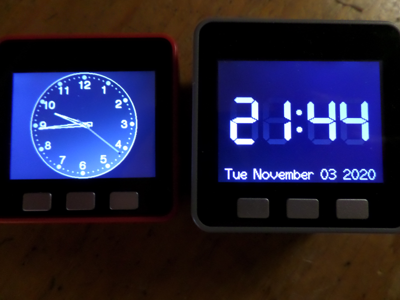
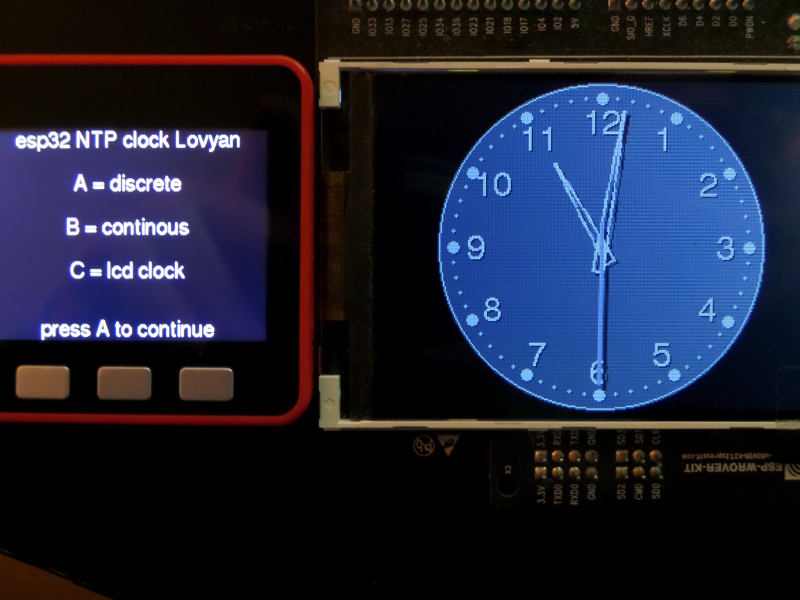

# esp32_NTP_clock_Lovyan

A simple clock demo demonstrating the [LovyanGFX](https://github.com/lovyan03/LovyanGFX) graphics library.

## Supported boards

- M5Stack Grey and Fire

- ESP Wrover Kit

## How to use

1. Install [LovyanGFX](https://github.com/lovyan03/LovyanGFX) in the Arduino libraries folder.

2. Select your board by uncommenting `#define LGFX_M5STACK` or `#define LGFX_ESP_WROVER_KIT`.

3. Adjust the wifi and timezone settings.

4. Flash to your esp32.

## Libraries used

- Button v 1.0 by [Jack Christensen](https://github.com/JChristensen/JC_Button) licensed under the Creative Commons Attribution-ShareAlike 3.0 Unported License.

